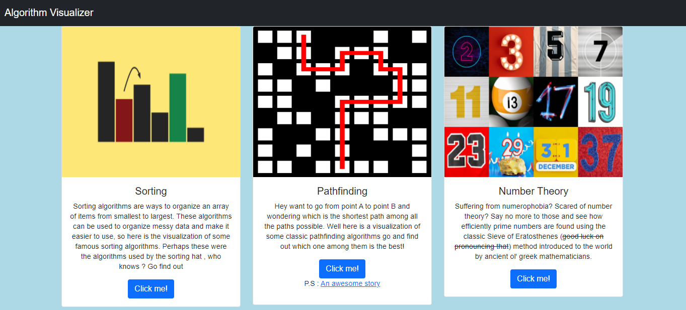
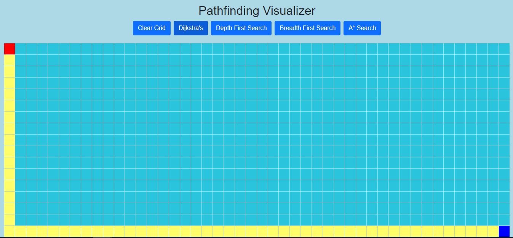
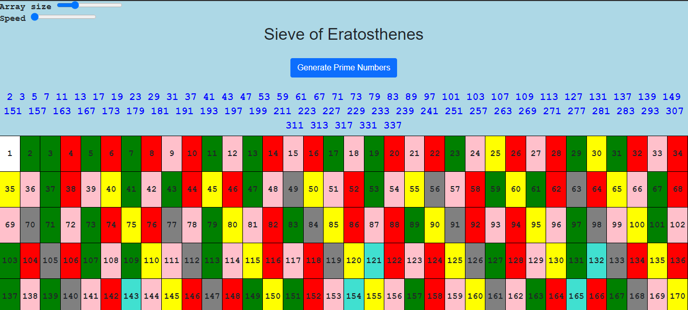
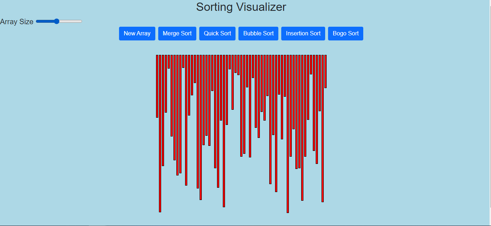

# Algo Visualizer
Welcome to Algo Visualizer, a simple web app for visualizing various sorting, pathfinding and number theory algorithms. This project is highly inspired by Clement Mihailescu's
<a href="https://www.youtube.com/watch?v=n4t_-NjY_Sg" target = "_blank"> work </a>. Built using HTML, CSS and vanilla Javascript. You can access the project <a href = "https://rishab-kulkarni.github.io/Algo-Visualizer/" target = "_blank">here</a>.

## Meet the algorithms
* Dijkstra's 
* A-star search
* Depth First Search
* Breadth First Search
* Sieve of Eratosthenes
* Sorting algorithms such as - Merge sort, Bubble sort, Quick sort and Insertion sort

## Screenshots

 

## TODO

  
Algorithms to be added

  
 - N-queens (backtracking)
 - Travelling salesman problem
 - Tree traversals (inorder, postorder, preorder)
 - More pathfinding algorithms - Best first search.

  
Improve code

  
 - Clean up code and organize it properly.
 - Implement stateful components in vanilla js <a href = "https://yamagata-developers-society.github.io/blog/stateful-components-vanilla-js/" target = "_blank"> here </a>

